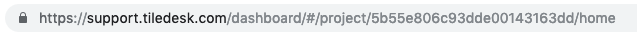

# REST API

## Introduction

Tiledesk is a live chat solution that helps businesses increase sales conversion by engaging important leads on their websites. It is our goal to help many of these businesses use the Tiledesk API \(the "API"\) to automate and enhance their customer support with Tiledesk.

## The API

This is the documentation for the Tiledesk REST API. Read the contents of this page carefully to understand how to be a good API citizen.

Endpoints are documented with the HTTP method for the request and a partial resource identifier. Example:

**GET /v1/{project\_id}**

Your Project ID \(this appears as project\_id in your code\) is a unique code assigned to your project when you create it in Tiledesk. There are a few ways you can find your Project ID.

The easiest way to find your Project ID is to check the URL of any page you have open in Tiledesk. It's the code that comes after /project/ in the URL. So for example, if we check the URL below you can see that the Project ID is _5c88a82990996000173cd4d1_.



Your Project ID is also available on the top of the Project Setting page of your dashboard.

To use the API prepend [https://api.tiledesk.com](https://api.tiledesk.com) to the resource identifier to get the full endpoint URL:

[https://api.tiledesk.com/v1/{project\_id}](https://api.tiledesk.com/v1/{project_id})

The examples in the docs are cURL statements. You can run the statements on a command line to try out different API requests. In Windows, you'll need to modify some of the examples in the docs to make them work.

## Security and Authentication

This API is an SSL-only API. You must be a Tiledesk user to make API requests.

Tiledesk supports two authentication methods:

* Basic Authentication
* JWT Authentication

### Basic authentication

Use the following authentication format with your email address and password:

**{email\_address}:{password}**

#### Example

```text
curl -v -X GET -u andrea.leo@f21.it:123456 https://api.tiledesk.com/v1/5ab0f32757066e0014bfd718/departments
```

### JWT authentication

Use the sign-in method to get a valid JWT token:

```text
curl -v -X POST -d 'email=<YOUR_EMAIL>&password=<YOUR_PASSWORD>' https://api.tiledesk.com/v1/auth/signin
```

Example

```text
curl -v -X POST -d 'email=andrea.leo@f21.it&password=123456' https://api.tiledesk.com/v1/auth/signin
```

Example: How to use JWT token

```text
curl -v -X GET -H 'Authorization: JWT <JWT_TOKEN>' https://api.tiledesk.com/v1/5ab0f32757066e0014bfd718/departments
```

#### Rate Limiting

This API is rate limited. We only allow a certain number of requests per minute. We reserve the right to adjust the rate limit for given endpoints in order to provide a high quality of service for all clients. As an API consumer, you should expect to be able to make at least 200 requests per minute.

If the rate limit is exceeded, Tiledesk will respond with a HTTP 429 Too Many Requests response code and a body that details the reason for the rate limiter kicking in.

#### Request Format

This is a JSON-only API. You must supply a _Content-Type: application/json_ header on PUT and POST requests. Sometimes you have to set an Accept: application/json header on a specific request. You may get a text/plain response in case of an error such as a bad request. You should treat this as an error you need to take action on.

#### Response Format

Tiledesk responds to successful requests with HTTP status codes in the 200 or 300 range. When you create or update a resource, Tiledesk renders the resulting JSON representation in the response body. Time stamps use UTC time and their format is **ISO8601**.

We respond to unsuccessful requests with HTTP status codes in the 400 range. The response may be "text/plain" content type for API level error messages \(such as when trying to call the API without SSL\). If you see a response from a known endpoint that looks like plain text, you probably made a syntax error in your REST call. If you ever experience responses with status codes in the 500 range, Tiledesk may be experiencing internal issues or having a scheduled maintenance \(during which we send a 503 Service Unavailable status code\). Please check the status page in such cases for any known issues.

When building an API client, we recommend treating any 500 status codes as a warning or temporary state. However, if the status persists and we don't have a publicly announced maintenance or service disruption, contact us at _info@frontiere21.it_.

## Leads

You can use the API to get or set lead information.



Get all leads



Allows an account to list all the leads.






the Project Id is a unique code assigned to your project when you create it in Tiledesk.





authorization token. Basic Auth or JWT



use "application/json" value





what field to sort the results by.



sort direction: 1 or -1. Return the results in ascending or descending order. _defaults to desc_



search a lead by the email address



what page of results to fetch. defaults to first page.










```text
{
   "perPage":40,
   "count":179,
   "leads":[
      {
         "_id":"5c81593adf767b0017d1aa66",
         "updatedAt":"2019-03-07T17:47:38.393Z",
         "createdAt":"2019-03-07T17:47:38.393Z",
         "lead_id":"SRbb2PfbSFcgICv9VQBcURZeloh1",
         "fullname":"Guest",
         "attributes":{
         ...
         },
         "id_project":"5b55e806c93dde00143163dd",
         "createdBy":"system",
         "__v":0
      },
      {
         "_id":"5c81565edf767b0017d1aa35",
         "updatedAt":"2019-03-07T17:35:26.132Z",
         "createdAt":"2019-03-07T17:35:26.132Z",
         "lead_id":"WTteQpKpGZN1aElfFYCP9YPaaLN2",
         "fullname":"Guest",
         "attributes":{
          ...
         },
         "id_project":"5b55e806c93dde00143163dd",
         "createdBy":"system",
         "__v":0
      },
      ...
   ]
}
```





Example

```text
curl -v -X GET -H 'Content-Type: application/json' -u andrea.leo@f21.it:123456 https://api.tiledesk.com/v1/5b55e806c93dde00143163dd/leads
```



Get a lead by id



Fetches a lead by his or her Lead ID






the lead identifier



The project\_id is a unique code assigned to your project when you create it in Tiledesk





authorization token. Basic Auth or JWT



use "application/json" value










```text
{  
         "_id":"5c81593adf767b0017d1aa66",
         "updatedAt":"2019-03-07T17:47:38.393Z",
         "createdAt":"2019-03-07T17:47:38.393Z",
         "lead_id":"SRbb2PfbSFcgICv9VQBcURZeloh1",
         "fullname":"Guest",
         "attributes":{ ... },
         "id_project":"5b55e806c93dde00143163dd",
         "createdBy":"system",
         "__v":0
}
```





Example

```text
curl -v -X GET -H 'Content-Type: application/json' -u andrea.leo@f21.it:123456 https://api.tiledesk.com/v1/5b55e806c93dde00143163dd/leads/5c81593adf767b0017d1aa66
```

### Create a Lead

_POST /v1/{project\_id}/leads_

Allows to add more leads.

```text
curl -v -X POST -H 'Content-Type: application/json' -u andrea.leo@f21.it:123456  -d '{"fullanem":"andrea", "lead_id":"123456"}' https://api.tiledesk.com/v1/5b55e806c93dde00143163dd/leads
```

## Requests

You can use the API to get the request information.



Get all requests



Allows an account to list all the requests for the project.






the Project Id is a unique code assigned to your project when you create it in Tiledesk.





authorization token. Basic Auth or JWT



use "application/json" value





what field to sort the results by.



sort direction: 1 or -1. Return the results in ascending or descending order. _defaults to desc_



what page of results to fetch. defaults to first page.










```text
{
   "perPage":40,
   "count":179,
   "requests":[
      {
            "_id":"5c81593adf767b0017d1aa67",
            "updatedAt":"2019-03-07T17:48:05.934Z",
            "createdAt":"2019-03-07T17:47:38.405Z",
            "request_id":"support-group-L_OG76RYhR0XFiMf2PK",
            "requester_id":"5c81593adf767b0017d1aa66",
            "first_text":"first text message",
            "department":"5c34ba232c62730016da250e",
            "sourcePage":"https://www.tiledesk.com",
            "language":"it",
            "userAgent":"Mozilla/5.0 (Macintosh; Intel Mac OS X 10_14_2) AppleWebKit/537.36 (KHTML, like Gecko) Chrome/72.0.3626.119 Safari/537.36",
            "id_project":"5b55e806c93dde00143163dd",
            "createdBy":"5c81593adf767b0017d1aa66",
            "__v":2,
            "waiting_time":21709,
            "agents":[
               {
                  "__v":0,
                  "createdBy":"5aaa99024c3b110014b478f0",
                  "user_available":true,
                  "role":"admin",
                  "id_user":"5ab0f3fa57066e0014bfd71e",
                  "id_project":"5b55e806c93dde00143163dd",
                  "createdAt":"2018-10-03T14:40:19.521Z",
                  "updatedAt":"2019-03-07T17:47:38.405Z",
                  "_id":"5bb4d4d39214830015742b00"
               }
            ],
            "tags":[
            ],
            "messages_count":7,
            "participants":[
               "5aaa99024c3b110014b478f0"
            ],
            "status":200,
            "lead":{..}
         }
      ...
   ]
}
```





Example

```text
curl -v -X GET -H 'Content-Type: application/json' -u andrea.leo@f21.it:123456 https://api.tiledesk.com/v1/5b55e806c93dde00143163dd/requests
```



Get a request by id



Fetches a lead by his or her request\_id






the request identifier



the Project Id is a unique code assigned to your project when you create it in Tiledesk.





authorization token. Basic Auth or JWT



use "application/json" value





what field to sort the results by.



sort direction: 1 or -1. Return the results in ascending or descending order. _defaults to desc_



what page of results to fetch. defaults to first page.










```text
{
   "_id":"5c81593adf767b0017d1aa67",
   "updatedAt":"2019-03-07T17:48:05.934Z",
   "createdAt":"2019-03-07T17:47:38.405Z",
   "request_id":"support-group-L_OG76RYhR0XFiMf2PK",
   "requester_id":"5c81593adf767b0017d1aa66",
   "first_text":"first text message",
   "department":"5c34ba232c62730016da250e",
   "sourcePage":"https://www.tiledesk.com",
   "language":"it",
   "userAgent":"Mozilla/5.0 (Macintosh; Intel Mac OS X 10_14_2) AppleWebKit/537.36 (KHTML, like Gecko) Chrome/72.0.3626.119 Safari/537.36",
   "id_project":"5b55e806c93dde00143163dd",
   "createdBy":"5c81593adf767b0017d1aa66",
   "__v":2,
   "waiting_time":21709,
   "agents":[
      {
         "__v":0,
         "createdBy":"5aaa99024c3b110014b478f0",
         "user_available":true,
         "role":"admin",
         "id_user":"5ab0f3fa57066e0014bfd71e",
         "id_project":"5b55e806c93dde00143163dd",
         "createdAt":"2018-10-03T14:40:19.521Z",
         "updatedAt":"2019-03-07T17:47:38.405Z",
         "_id":"5bb4d4d39214830015742b00"
      }
   ],
   "tags":[
   ],
   "messages_count":7,
   "participants":[
      "5aaa99024c3b110014b478f0"
   ],
   "status":200,
   "lead":{..}
}
```





Example:

```text
curl -v -X GET -H 'Content-Type: application/json' -u andrea.leo@f21.it:123456 https://api.tiledesk.com/v1/5b55e806c93dde00143163dd/requests/support-group-L_OG76RYhR0XFiMf2PK
```

### Legal notices

Restrictions and responsibilities Your use and access to the API is expressly conditioned on your compliance with the policies, restrictions, and other provisions related to the API set forth in our API Restrictions and Responsibilities and the other documentation we provide you. You must also comply with the restrictions set forth in the Terms of Service and the Privacy Policy that apply to your use of the Tiledesk Service, in all uses of the API. If Tiledesk believes that you have or attempted to violate any term, condition or the spirit of these policies or agreements, your right to access and use the API may be temporarily or permanently revoked.

Change Policy Tiledesk may modify the attributes and resources available to the API and our policies related to access and use of the API from time to time without advance notice. Tiledesk will use commercially reasonable efforts to notify you of any modifications to the API or policies through notifications or posts on the Tiledesk Website. Modification of the API may have an adverse effect on Tiledesk Applications, including but not limited to changing the manner in which Tiledesk Applications communicate with the API and display or transmit Your Data. Tiledesk will not be liable to you or any third party for such modifications or any adverse effects resulting from such modifications.

